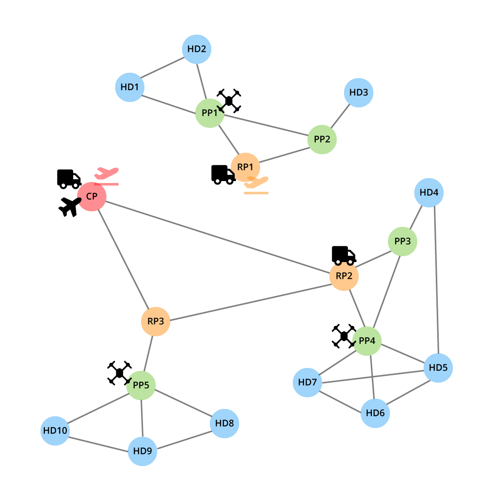

# Assignment 1 - Autonomous Software Agents

Build a **PDDL/MA-PDDL national vaccine distribution** domain and problem, according to the guidelines specified into the `ASA-assignment-1.pdf` file.  
First assignment for the *Autonomous Software Agents* course @ UNITN.

All the project specifications, planner design choices, problems and future improvements can be found inside the `report.pdf` file.

### Small problem
A test environment with a small problem to be solved.

*1 central point, 3 regions, 5 provinces, 10 health districts, 2 airports, 1 plane, 2 trucks, 3 drones and a total of 10 vaccine boxes to be distributed*

### ⚙️ Tools
**Local planner**:
- [MetricFF](https://fai.cs.uni-saarland.de/hoffmann/metric-ff.html) on the provided Virtual Machine

**Online planners**:
- [PDDL Editor](http://editor.planning.domains/)

### 🔧 How to use
- Clone the repository [`https://github.com/sebastianochiari/ASA-assignment-1`](https://github.com/sebastianochiari/ASA-assignment-1)
- If you are using the online planner, load the `vaccine-domain.pddl` file and the `vaccine-problem-*.pddl` (choose the full problem description or a small version) and click solve
- If you are using the local planner, execute the following command (all the files must be placed in the same folder of MetricFF)  
    >`./ff -o vaccin-domain.pddl -f vaccine-problem-*.pddl -s 0`
