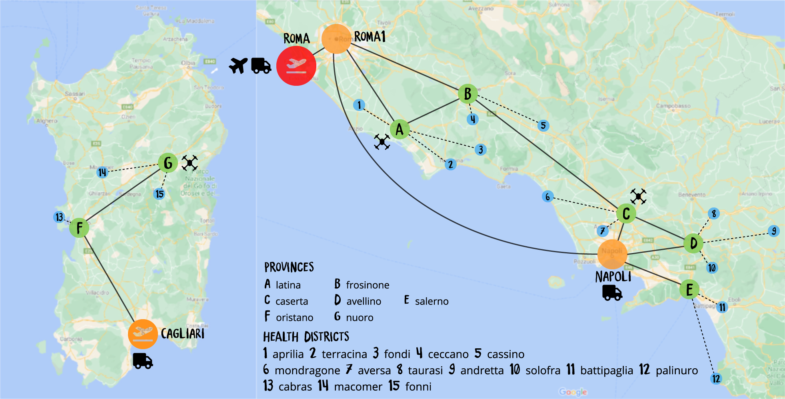
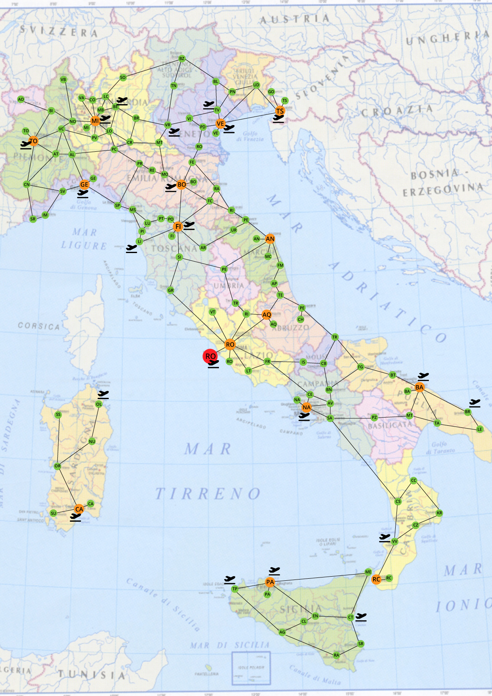

# Assignment 1 - Autonomous Software Agents

The project consists in building a **PDDL/MA-PDDL national vaccine distribution** domain and problem, according to the guidelines specified into the `ASA-assignment-1.pdf` file.  
First assignment for the *Autonomous Software Agents* course @ UNITN.

### ⚙️ Tools

- [MetricFF](https://fai.cs.uni-saarland.de/hoffmann/metric-ff.html), **local planner** on the provided Virtual Machine for the single agent version
- [Maplan](https://gitlab.com/danfis/maplan), **local planner** on the provided Virtual Machine for the multi-agent version
    > Maplan doesn't support plenty of libraries useful to solve the problem (such as `:conditional-effects` or `:fluents`)
- [PDDL Editor](http://editor.planning.domains/), **online planner** (works only with very small problems due to a server-side resource contrainsts)

### 🔧 How to use
- Clone the repository [`https://github.com/sebastianochiari/ASA-assignment-1`](https://github.com/sebastianochiari/ASA-assignment-1)
- If you are using the online planner, load the `vaccine-domain.pddl` file and the `vaccine-problem-*.pddl` (choose the full problem description or a small version) and click solve
- If you are using the local planner, execute the following command (all the files must be placed in the same folder of MetricFF)  
    >`./ff -o vaccin-domain.pddl -f vaccine-problem-*.pddl -s 0`

### 📜 Report

The report `asa-assignment1-report.pdf` includes all the details about project specifications, domain and problem implementation and design choices, problems and error analysis. 

### 📝 Small problem
A test environment with a small problem to be solved.

> 1 central point, 3 regions, 7 provinces, 15 health districts, 2 airports, 1 plane, 3 trucks, 3 drones and a total of 15 vaccine boxes to be distributed

This problem has been solved by using Metric FF over the provided virtual machine, with 14GB of dedicated RAM, in about 2 hours.

### 📝 Full problem
The full problem, satisfying all the contrainsts given with the assignment guidelines.

> 1 central point, 15 regions, 113 provinces, 412 health districts, 21 airports, 10 planes, 22 trucks, 78 drones, 412 vaccine boxes

The full problem is generated via `generator.py`, a Python script, and some additional `.txt` containing all the necessary information to build the complete problem: all the files can be found in the `src/utils/` folder.

### 📝 Multi agent
Two possible implementation for the MA-PDDL can be found in the `src/multi-agent/` folder:

- the `working` folder contains the biggest version of the implementation that the planner is able to solve.
- the `attempt` folder contains the full theoretical MA-PDDL version (not working because of maplan limitations)